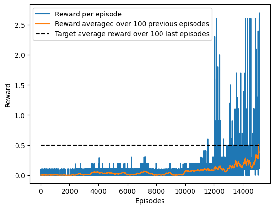

# Learning Algorithm

The algorithm used to solve the environment is a DDPG. A DDPG architecture is composed of four networks with two different architectures:

- Two critic networks with same architecture:
  - A local critic: This is the network that actually learns to estimate the expected reward.
  - A target critic: This network is used to fix targets local critic must learn.
- Two actor networks with same architecture
  - A local actor: This is the network that actually learns the policy
  - A target actor: This is the network used to generate actions used to train the critic.

Since our DDPG setting involves two agents, we use 8 different networks (previous 4, twice).

Regarding loss functions, two different losses are involved during training:

- Critic loss
- Actor loss

To better understand each loss, let's outline training loop of a simple DDPG agent (not two agents as our setting) during a single episode.

1. Feed current state (S) to the **local actor**. This outputs current timestep actions (A).
2. Step in the environment with actions A. Next state (S'), reward (R) and termination flag (D).
3. Save experience (S,A,R,S',D) in the replay buffer.
4. Update networks:
   1. Sample a batch of experiences from the replay buffer [(S,A,R,S',D),...]
   2. Compute **local critic** loss:
      1. Feed S' into **target actor** to get A'.
      2. Feed (S,A) to **local critic** and (S',A') to **target critic**.
      3. Compute **local critic** loss: $R+\gamma max_a\hat{q}(S',A',w^-)-\hat q(S,A,w)$
   3. Compute **local actor** loss:
      1. Feed S into **local actor** to get a more updated estimate of A, A_upd.
      2. Feed S and A_upd into **local critic** to get R_local_critic.
      3. Compute **local actor** loss: $-R_{local\_critic}$
   4. Update local networks with their respective losses.
   5. Soft update target networks from local networks.
5. Check D flag. If true, end episode. If false, make S = S' and go back to 1.

The following rewards are obtained from training.

As it can be seen in next image, environment was solved after 15134 episodes.

# Future Improvements

1. Add Batch Normalization layers to boost and stabilize training.
2. Create shared experience replay buffer to boost training.
3. Share local actor networks to boost training.
